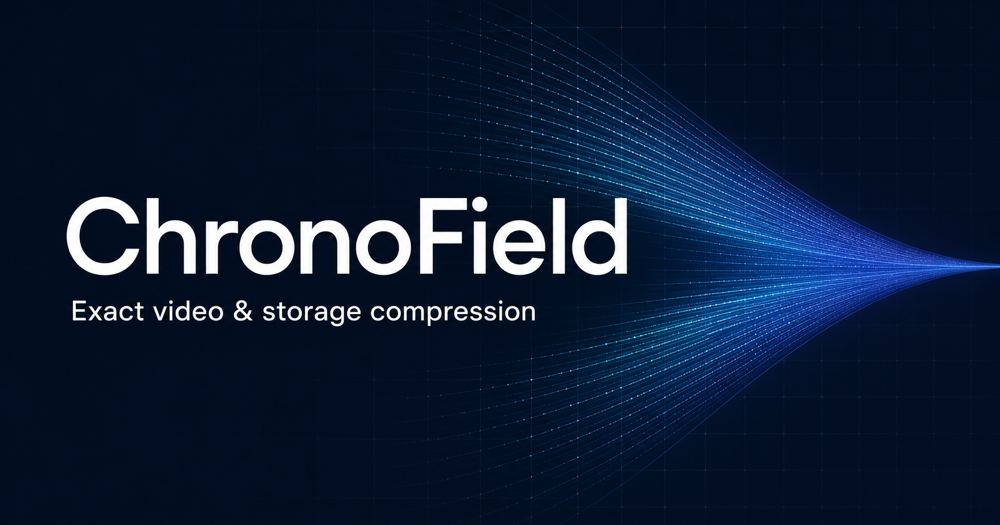

  

<h1 align="center">ChronoField</h1>

  <strong>A new exact-video infrastructure stack: up to 45.6x faster AV1 encoding, up to 55.25% fewer bytes, and only 7.375% of RAW retained with CFT + CFMS.</strong>

  <a href="./ChronoField-safe-investor-deck.pdf"><strong>Open the 12-slide investor deck →</strong></a>

---

## Breakthrough operating points

ChronoField does not force one compromise between speed and compression depth:

| Mode | Measured result |
| --- | --- |
| **Ultra Fast** | Up to **45.63x faster encoding** than AV1 on the same exact Full-HD frames, with **37.87% fewer bytes** |
| **Fast** | **41.37% fewer bytes**, **8.42x faster encode** and **4.98x faster decode** across three real 1080p sources |
| **Archive** | Up to **55.25% fewer bytes** than the measured AV1 lossless baseline |
| **CFT + CFMS** | **451.13 MB from 6.117 GB RAW** for an exact eight-resolution family: only **7.375% of RAW remains** |
| **CFMS related-video gate** | **56.26 MB → 20.73 MB** after individual CFT compression: an additional **63.15% reduction**, exact 20/20, **256.57 aggregate decode fps** |

Every promoted result reconstructs the original RGB frames exactly.

## Current proof

ChronoField is a working native exact-video codec and storage system.

The machine-readable result archive contains **225 recorded CFT-versus-AV1 size comparisons: 225 wins, no ties and no losses** across 62 result files and 33 benchmark suites.

In the retained CFT11 three-source Full-HD aggregate:

| Metric | Versus strict-lossless AV1 `cpu-used=4` |
| --- | ---: |
| Compressed bytes | **41.37% fewer** |
| Encode speed | **8.42× faster** |
| Decode speed | **4.98× faster** |
| Reconstruction | **Exact RGB SHA-256** |

All three real 1080p sources produced fewer bytes than both measured AV1 baselines. Peak completed Full-HD operating points reach **55.25% fewer bytes** and **29.39× faster encoding** than the measured AV1 baseline.

The current production release is **CFT11 0.28.0** with native decoder v8. Its
lossless member and collection wire formats remain unchanged, the retained
artifacts remain byte-for-byte stable, and its release gate passes **529
tests**.

> The comparison uses the same source frames and hardware for every codec, verifies exact RGB output, and is packaged for controlled third-party reproduction.

## Competitive position

Traditional lossless codecs preserve the source but do not demonstrate
ChronoField's measured Full-HD combination of density and speed. The most
relevant published neural exact-video competitor we found, NeuralLVC, reports
approximately **0.06 fps** on CIF video using an NVIDIA GH200. Fast neural
systems such as Microsoft DCVC optimize lossy rate-distortion, while
generative systems such as ByteDance CascadeV do not reconstruct the original
pixels exactly.

Our review found no public codec report demonstrating the same combination of
**exact RGB reconstruction, fewer Full-HD bytes than lossless AV1, faster
encode, faster decode, and a second exact family-storage layer**.

[Read the non-confidential competitive note →](./COMPETITIVE_POSITION.md)

## Why it matters

Lossless video is expensive to keep and move. Better compression can reduce infrastructure cost in:

- media archives and production pipelines;
- exact-source and mezzanine storage;
- AI and computer-vision datasets;
- scientific, medical, and regulated workflows where reconstruction must be exact.

## Next milestone

The immediate objective is independent reproduction on third-party hardware and independently selected content, followed by server optimization and narrow design-partner deployments.

## Non-confidential materials

- [Investor deck — 12 slides](./ChronoField-safe-investor-deck.pdf)
- [Competitive position — exact, neural and generative codecs](./COMPETITIVE_POSITION.md)

## Disclosure boundary

This repository intentionally contains **no source code, binaries, formulas, dictionaries, bitstream grammar, benchmark corpus, internal architecture, or protected implementation mechanics**.

## Contact

**Absamad Manturov — Founder**

[Email](mailto:absamad.manturov@gmail.com) · [GitHub](https://github.com/Absamad-dew) · [Telegram](https://t.me/Absamad_m)

---

All rights reserved. Publication grants no license to the underlying technology or these materials.
